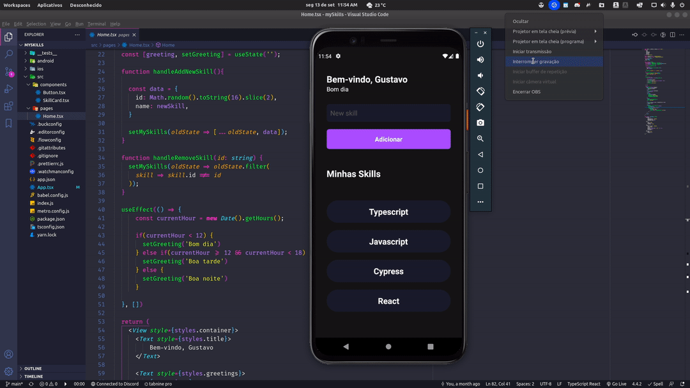

<!-- PROJECT SHIELDS -->
[![LinkedIn][linkedIn-shield]][linkedin-url]
[![LastCommit][last-commit-shield]][last-commit-url]
[![Issues][issues-shield]][issues-url]

<br />
<!-- TABLE OF CONTENTS -->
<details open="open">
  <summary>📌 Índice</summary>
  <ol>
    <li>
      <a href="#sobre-o-projeto">Sobre o Projeto</a>
      <ul>
        <li><a href="#tecnologias">Tecnologias</a></li>
      </ul>
    </li>
    <li>
      <a href="#wrench-como-instalar">Como instalar</a>
      <ul>
        <li><a href="#pré-requisitos">Pré-requisitos</a></li>
        <li><a href="#instalação">Instalação</a></li>
      </ul>
    </li>
    <li><a href="#bug-problemas">Problemas</a></li>
    <li><a href="#closed_book-licença">Licença</a></li>
  </ol>
</details>

## Sobre o Projeto

<div align="center">
   
</div>
<br />

> :iphone: Aplicativo para inclusão de skills. Desenvolvido no Ignite da [#Rocketseat][rocketseat]

<br />

## Tecnologias

Neste projeto foi utilizado as seguintes tecnologias:

* [React Native](https://reactnative.dev)
* [TypeScript](https://www.typescriptlang.org/)
* [Styled-Components](https://styled-components.com)

## :wrench: Como instalar

### Pré-requisitos

* npm
  ```bash
  npm install npm@latest -g
  ```

* yarn
  ```bash
  npm install --global yarn
  ```

### Instalação
###### 1. Clone o Repositório
```bash
git clone https://github.com/gvieiram/mySkills.git
```

###### 2. Instale as dependências
```bash
yarn | npm install
```

###### 4. Abra o emulador
Instale e abra o emulador do Android Studio. Para configurá-lo clique [aqui](https://developer.android.com/studio/install?hl=pt-br)


###### 5. Instale o projeto
```bash
yarn android | npm run android
```

###### 6. Rode o projeto
```bash
yarn start | npm run start
```

Agora o projeto está rodando em seu emulador android :iphone:

## :bug: Problemas

Fique a vontade **para criar uma nova issue** com o respectivo título e descrição nas [issues][issues-url] do **mySkills**. Se você já encontrou a solução para o problema, **eu amaria fazer o review do seu pull request**!

## :closed_book: Licença

Lançado em 2021 :closed_book: Licença

Feito com :heart: por [Gustavo Vieira Martins][github].
Esse projeto esta sobre [MIT license][license-url].
Dê uma ⭐️ se esse projeto te ajudou!


<!-- MARKDOWN LINKS & IMAGES -->
<!-- https://www.markdownguide.org/basic-syntax/#reference-style-links -->
[github]: https://github.com/gvieiram
[rocketseat]: https://rocketseat.com.br/
[LinkedIn-shield]: https://img.shields.io/badge/Gustavo%20Vieira%20Martins-5f5f5f?style=flat&logo=Linkedin&logoColor=FFF
[linkedIn-url]: https://www.linkedin.com/in/gustavovieiram
[last-commit-shield]: https://img.shields.io/github/last-commit/gvieiram/mySkills?color=6933FF
[last-commit-url]: https://github.com/gvieiram/mySkills/commits/main
[issues-shield]: https://img.shields.io/github/issues/gvieiram/mySkills?color=6933FF
[issues-url]: https://github.com/gvieiram/mySkills/issues
[license-shield]: https://img.shields.io/github/license/gvieiram/mySkills?color=6933FF
[license-url]: https://github.com/gvieiram/mySkills/blob/main/LICENSE
